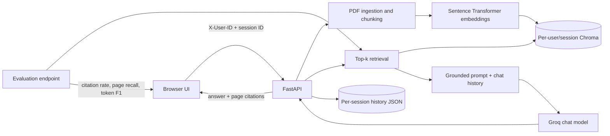

# Document RAG

A production-shaped PDF question-answering application with a FastAPI backend, a responsive web interface, persistent vector search, page-level citations, conversation memory, and user-isolated document sessions.

## Features

- Upload and index several PDFs in one request.
- Answers grounded in retrieved passages, with document and page citations.
- Separate Chroma collection, uploads, and chat history for every user/session pair.
- Persistent conversation history for follow-up questions.
- Built-in evaluation endpoint for citation presence, retrieval page recall, and token F1.
- OpenAPI documentation at `/docs` and a health check at `/health`.
- Docker image and Compose setup with a persistent data volume.

## Architecture



Isolation is enforced server-side: a session is resolved only beneath the validated `X-User-ID` directory. Knowing another user's session ID is not sufficient to access it. This is storage isolation, not authentication: callers can claim any valid `X-User-ID`. Do not describe this application as a secure multi-tenant SaaS until the header is replaced by a server-verified identity from JWT middleware or an identity provider such as Clerk, Auth0, Firebase Auth, or Supabase Auth.

## Quick start

Requires Python 3.11.

```powershell
python -m venv .venv
.venv\Scripts\Activate.ps1
python -m pip install -r requirements.txt
Copy-Item .env.example .env
```

Set `GROQ_API_KEY` in `.env`; the application loads this file automatically. Alternatively, set the variable directly:

```powershell
$env:GROQ_API_KEY = "your_key"
python app.py
```

Open <http://localhost:8000>. Interactive API documentation is available at <http://localhost:8000/docs>.

The old Gradio error is removed at its source: this application no longer depends on Gradio or its incompatible `huggingface_hub.HfFolder` import. Install into a fresh virtual environment so stale global packages cannot affect the application.

## Docker

```powershell
Copy-Item .env.example .env
# Add your GROQ_API_KEY to .env
docker compose up --build
```

Indexed documents and histories live in the named `rag_data` volume. PDFs and `.env` are excluded from the image build context.

## API workflow

All `/api` requests require an `X-User-ID` header containing 1–80 letters, numbers, underscores, or hyphens.

1. `POST /api/sessions` with `{"title":"Research"}`.
2. `POST /api/sessions/{id}/documents` as multipart form data; repeat the `files` field for multiple PDFs.
3. `POST /api/sessions/{id}/chat` with `{"question":"What are the findings?"}`.
4. `GET /api/sessions/{id}/history` to retrieve the conversation.

The chat response includes an answer plus structured citations:

```json
{
  "answer": "The reported result is ... [report.pdf, p. 7]",
  "citations": [{"document": "report.pdf", "page": 7, "excerpt": "..."}]
}
```

## Evaluation

`POST /api/sessions/{id}/evaluate` runs a small grounded-RAG evaluation suite without adding a heavyweight framework:

```json
{
  "cases": [
    {
      "question": "What is the main conclusion?",
      "expected_answer": "Optional reference answer",
      "expected_pages": [7, 8]
    }
  ]
}
```

It reports:

- `citation_present`: fraction of generated answers containing a valid page citation.
- `page_recall`: fraction of expected pages found by retrieval.
- `answer_token_f1`: lexical overlap with an optional reference answer.

This deterministic harness is suitable for regression checks. RAGAS can later be layered on top when judge-model metrics and their additional API cost are desired.

## Configuration

| Variable | Default | Purpose |
|---|---|---|
| `GROQ_API_KEY` | required | Groq credential |
| `GROQ_MODEL` | `llama-3.3-70b-versatile` | Chat model |
| `EMBEDDING_MODEL` | `sentence-transformers/all-MiniLM-L6-v2` | Local embedding model |
| `FASTEMBED_CACHE_DIR` | `./data/fastembed_cache` | Persistent FastEmbed model cache |
| `RAG_TOP_K` | `5` | Retrieved chunks per question |
| `MAX_FILE_MB` | `25` | Per-file upload limit |
| `RAG_DATA_DIR` | `./data` | Persistent isolated storage |
| `PORT` | `8000` | Local application port |

## Tests

```powershell
python -m pip install pytest httpx
python -m pytest
```

## Production hardening

Before a public deployment:

- Replace `X-User-ID` with a server-generated user ID from verified JWT claims or a managed identity provider.
- Store sessions and chat history in PostgreSQL, uploads in object storage, and distributed locks, queues, and caches in Redis.
- Use a managed vector database or a persistent, deployment-safe Chroma service.
- Split the application into `api/`, `services/`, `retrieval/`, `storage/`, `evaluation/`, `models/`, and `security/` modules as it grows.
- For a limited public demo, pre-index sample documents, enforce strict upload and request limits, add API throttling and model-cost controls, and keep source citations visible.

The previously committed OpenRouter credential must be revoked at the provider even after Git history is rewritten. Generate a replacement only after revocation, store it outside Git, and enable GitHub secret scanning before sharing the repository.
